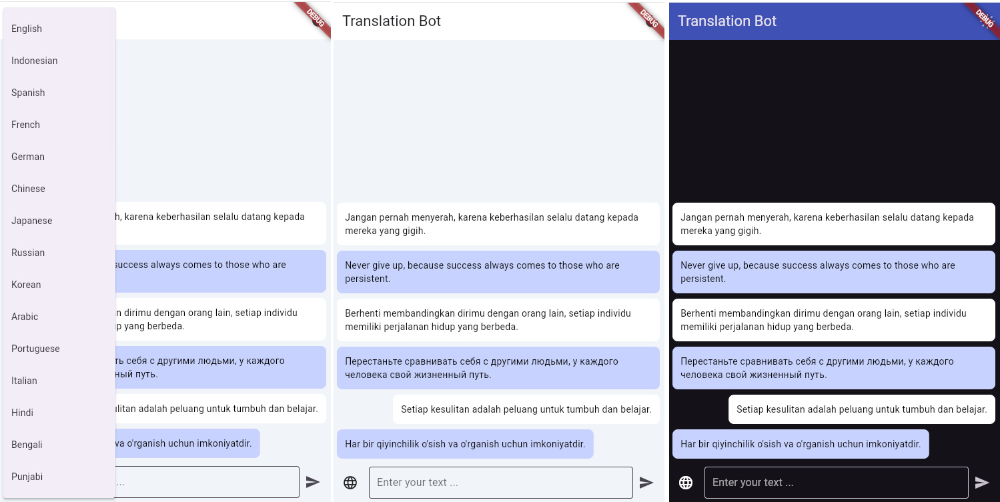

# Translation Bot (Flutter App)

Translation Bot is an application that makes it easy for users to translate text from one language to another instantly. This application is designed to provide accurate and fast translation results with a user-friendly interface, supporting multiple languages ​​from around the world.

## Installer
```
git clone https://github.com/fitri-hy/translation-bot-flutter.git
cd translation-bot-flutter
flutter pub get
flutter run
```

## Recomended
```
Flutter 3.22.2
SDK 34.0.0
JDK 19
Java 22.0.1
```

Testing Demo: <a href="https://github.com/fitri-hy/translation-bot-flutter/tree/main/demo">Go to Demo Folder</a>
